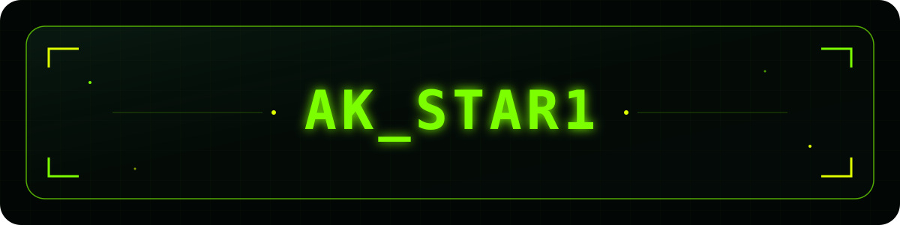

<div align="center">
  
</div>

<br>


<div align="center">

# ⚡ AK_STAR1 


<br>

```text
╔════════════════════════════════════════════════════════════╗
║                                                            ║
║                  A K _ S T A R 1                           ║
║                                                            ║
║        STATUS        ● ONLINE                              ║
║        MODE          BUILDING                              ║
║        LOCATION      THE INTERNET                          ║
║        OBJECTIVE     CREATE IMPACT                         ║
║                                                            ║
╚════════════════════════════════════════════════════════════╝
```

<div align="center">


</div>


